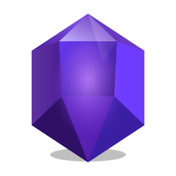

  

  # Obsidian Fault Script

  **A self-hosted compiled language for native programs and the Web.**

  
  
  
  
  
  

  [**Official Site**](https://samwns.github.io/Obsidian-Fault-Script/docs/)
  · [**Documentation**](https://samwns.github.io/Obsidian-Fault-Script/docs/getting-started.html)
  · [**Downloads**](https://github.com/Samwns/Obsidian-Fault-Script/releases/latest)
  · [**Benchmark**](https://samwns.github.io/Obsidian-Fault-Script/docs/benchmark.html)
  · [**Sponsor / Apoiar**](https://ko-fi.com/samwns)

 

  

